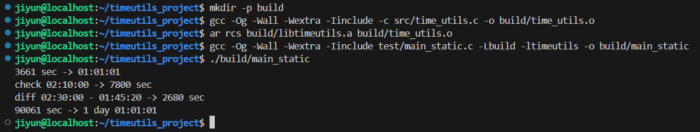
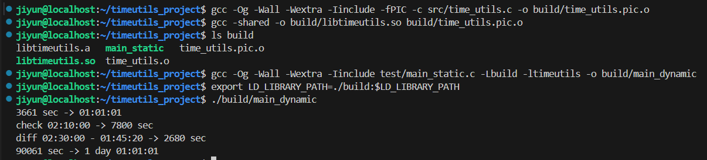
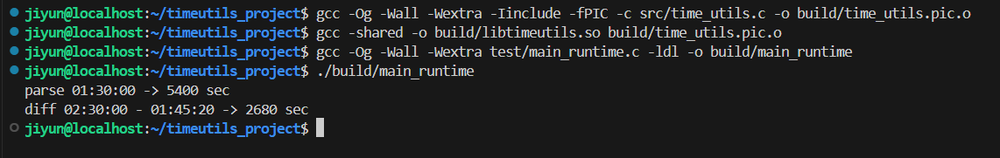

# Time Utilities Library
---


본 프로젝트는 C 언어로 작성한 간단한 날짜·시간 처리 유틸리티 라이브러리입니다. 
하나의 라이브러리 소스를 기반으로 Static Linking, Dynamic Linking, 그리고 Runtime Linking(dlopen/dlsym) 방식을 각각 구현하여  
링킹 방식의 차이를 직접 실습하고 비교하는 것을 목표로 했습니다. 

---

## 개발 환경
- OS: Ubuntu 20.04 LTS (WSL)
- Compiler: GCC
- Language: C


---


## 프로젝트 구조
```text
timeutils_project/
├── include/
│   └── time_utils.h
├── src/
│   └── time_utils.c
├── test/
│   ├── main_static.c
│   └── main_runtime.c
├── build/
│   ├── libtimeutils.a
│   ├── libtimeutils.so
│   ├── main_static
│   ├── main_dynamic
│   └── main_runtime
└── README.md
```


---


## 제공 기능
- 초 → 시:분:초 변환
- 시:분:초 → 초 변환
- 시각 문자열(`HH:MM:SS`) 파싱
- 두 시각 간 차이 계산
- 초 → 일:시:분:초 변환


---


## static Linking (정적 링킹)

정적 링킹은 라이브러리 코드를 실행 파일 내부에 포함시키는 방식입니다. 

### 1. 객체 파일 생성
```bash
gcc -Og -Wall -Wextra -Iinclude -c src/time_utils.c -o build/time_utils.o
```

### 2. 정적라이브러리 생성
```bash
ar rcs build/libtimeutils.a build/time_utils.o
```

### 3. 실행파일 생성
```bash
gcc -Og -Wall -Wextra -Iinclude test/main_static.c -Lbuild -ltimeutils -o build/main_static
```

### 4. 실행
```bash
./build/main_static
```




---

## 동적링킹
동적 링킹은 실행 시 공유 라이브러리(.so)를 로드하는 방식입니다. 

### 1. PIC 객체 파일 생성
```bash
gcc -Og -Wall -Wextra -Iinclude -fPIC -c src/time_utils.c -o build/time_utils.pic.o
```

### 2️. 공유 라이브러리 생성
```bash
gcc -shared -o build/libtimeutils.so build/time_utils.pic.o
```

### 3️. 실행 파일 생성
```bash
gcc -Og -Wall -Wextra -Iinclude test/main_static.c -Lbuild -ltimeutils -o build/main_dynamic
```

### 4️. 라이브러리 경로 설정
```bash
export LD_LIBRARY_PATH=./build:$LD_LIBRARY_PATH
```

### 5️. 실행
```bash
./build/main_dynamic
```




---

## 런타임링킹
Runtime Linking은 실행 중에 dlopen과 dlsym을 사용하여 라이브러리를 동적으로 로드하는 방식입니다. 

### 1️. 공유 라이브러리 생성
```bash
gcc -Og -Wall -Wextra -Iinclude -fPIC -c src/time_utils.c -o build/time_utils.pic.o
gcc -shared -o build/libtimeutils.so build/time_utils.pic.o
```

### 2️. 런타임 링크 실행 파일 생성
```bash
gcc -Og -Wall -Wextra test/main_runtime.c -ldl -o build/main_runtime
```

### 3️. 실행
```bash
./build/main_runtime
```




---

## 정리

본 프로젝트는 하나의 라이브러리 소스를 유지하면서 빌드 및 링크 방식만 변경하여 세 가지 링킹 방식을 비교하였습니다.
이를 통해 링커의 동작 방식과 실행 시 라이브러리 로딩 차이를 직접 확인할 수 있었습니다. 


